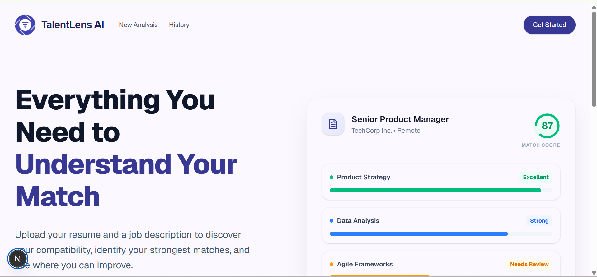
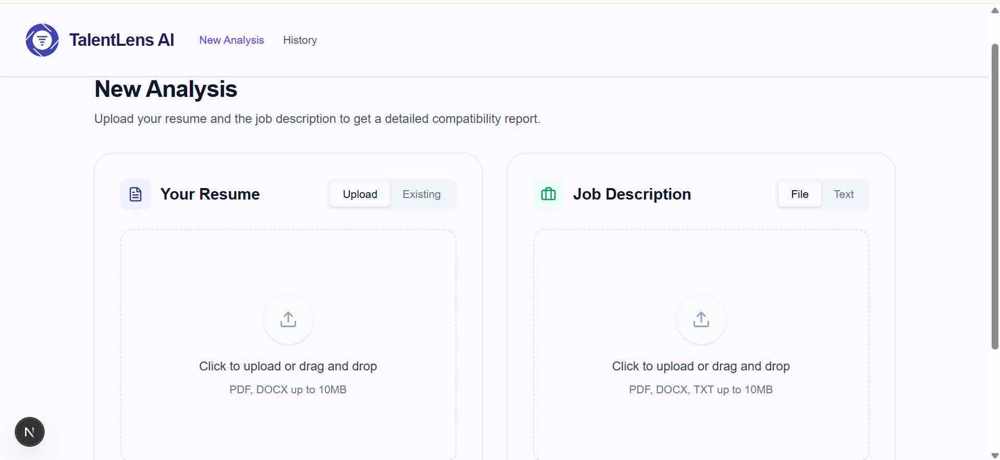
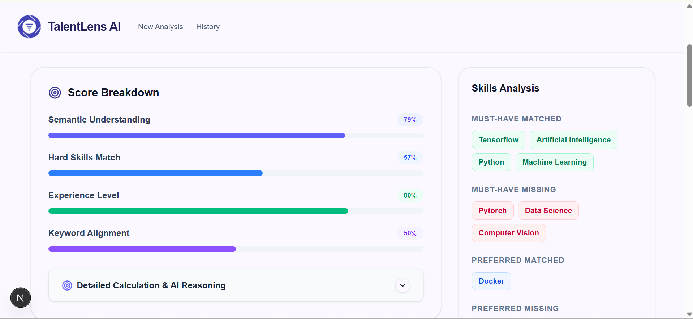
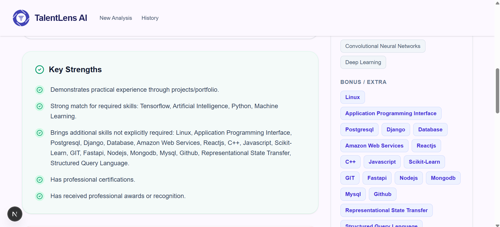
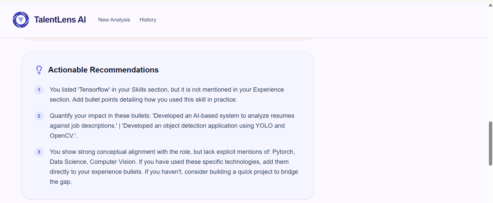
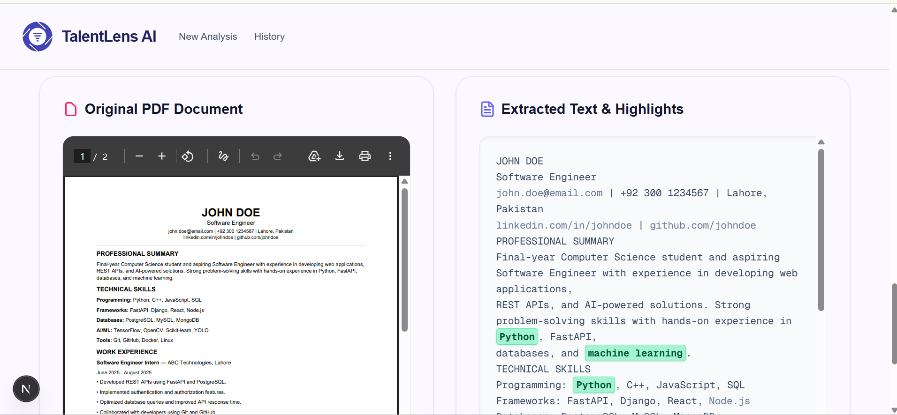
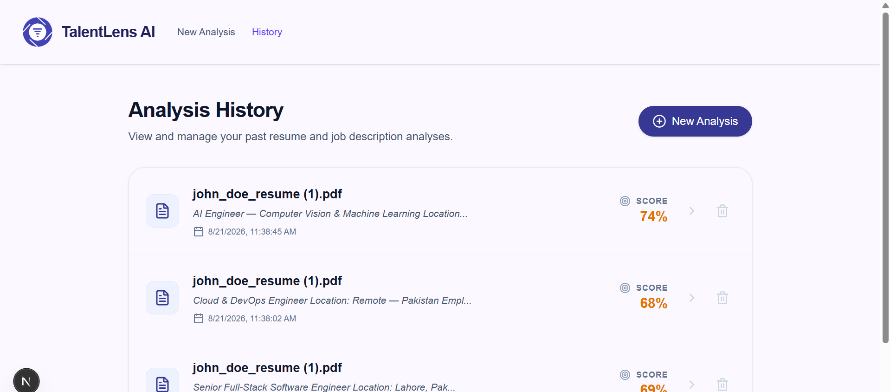

# TalentLens AI

TalentLens AI is an AI-powered resume analysis and scoring application. It extracts skills and experience from candidate resumes and matches them against job descriptions to generate an explainable compatibility score.

## Screenshots

### Landing Page

<div align="center">
  
</div>

### Resume & Job Description Analysis

<div align="center">
  
</div>

### Analysis Results

<div align="center">
  
  <br/><br/>
  
  <br/><br/>
  
  <br/><br/>
  
</div>

### Analysis History

<div align="center">
  
</div>

## Detailed Overview

TalentLens AI goes beyond simple keyword matching to provide a holistic, human-like evaluation of candidate resumes. It achieves this through a multi-layered NLP pipeline and a dynamic scoring engine.

### How it Works

1. **Document Parsing & Preprocessing:** Candidate resumes (PDFs) are parsed in the browser with PDF.js. Text is normalized for clean NLP input.
2. **Skill & Section Extraction:** Heuristic section detection plus a curated skill vocabulary extract hard skills, experience cues, and resume structure.
3. **Dynamic Requirement Analysis:** The job description is split into must-have vs preferred skills, required years, and keywords.
4. **Intelligent Scoring Engine:** The same `ResumeMatchingEngine` logic (ported to TypeScript) scores four pillars with dynamic weights.
5. **Semantic Similarity:** `all-MiniLM-L6-v2` runs in the browser via Transformers.js for skill-pair similarity (same model family as before).

### The Four Scoring Pillars

- **Semantic Understanding (40%):** Contextual alignment between resume and JD skills.
- **Hard Skills Match (30%):** Exact / equivalent / related skill classification.
- **Experience Level (20%):** Years and date-range extraction vs JD requirements.
- **Keyword Alignment (10%):** Domain terminology overlap.

### Actionable Insights

- Score breakdown & weighted contributions
- Strengths & gaps
- Actionable recommendations

## Architecture (demo-friendly / low-cost)

Everything needed for a working demo runs **in the browser**. No Railway backend or Postgres is required.

| Layer | Tech | Role |
|--------|------|------|
| UI | Next.js (App Router), React, Tailwind | Pages & interactions |
| Storage | IndexedDB (per browser) | Resumes, PDFs, analysis history |
| PDF | PDF.js | Text extraction |
| NLP | Transformers.js + MiniLM | Skill semantic similarity |
| Engine | TypeScript port of `ResumeMatchingEngine` | Scoring + recommendations |

**Hosting tip:** Deploy only the frontend (e.g. Vercel). You can shut down the Railway FastAPI + Postgres services to avoid the $5 ML/DB spend. The optional `backend/` folder remains as a reference implementation of the original Python pipeline.

History is **browser-local** (same privacy model as before via a local owner UUID). Clearing site data clears history.

---

## Setup Instructions

### Prerequisites

- Node.js (v18+)

### Frontend (all you need)

```bash
cd frontend
npm install
npm run dev
```

Open [http://localhost:3000](http://localhost:3000).

The first analysis downloads the MiniLM model into the browser cache (one-time; may take a minute).

### Optional: legacy Python backend

The FastAPI + Postgres stack under `backend/` still exists for local experiments, but the Next.js app no longer calls it.

```bash
cd backend
docker compose up -d
python -m venv .venv && source .venv/bin/activate
pip install -r requirements.txt
uvicorn app.main:app --reload
```
